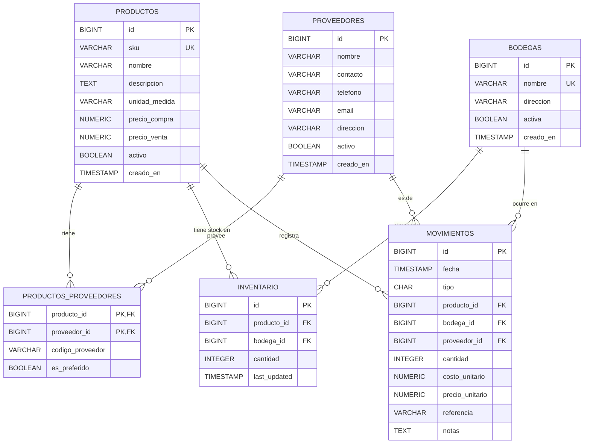

# Diagrama Entidad-Relación (ER)

```mermaid
erDiagram
    PROVEEDORES {
        BIGINT id PK
        VARCHAR nombre
        VARCHAR contacto
        VARCHAR telefono
        VARCHAR email
        VARCHAR direccion
        BOOLEAN activo
        TIMESTAMP creado_en
    }

    BODEGAS {
        BIGINT id PK
        VARCHAR nombre UK
        VARCHAR direccion
        BOOLEAN activa
        TIMESTAMP creado_en
    }

    PRODUCTOS {
        BIGINT id PK
        VARCHAR sku UK
        VARCHAR nombre
        TEXT descripcion
        VARCHAR unidad_medida
        NUMERIC precio_compra
        NUMERIC precio_venta
        BOOLEAN activo
        TIMESTAMP creado_en
    }

    PRODUCTOS_PROVEEDORES {
        BIGINT producto_id PK, FK
        BIGINT proveedor_id PK, FK
        VARCHAR codigo_proveedor
        BOOLEAN es_preferido
    }

    INVENTARIO {
        BIGINT id PK
        BIGINT producto_id FK
        BIGINT bodega_id FK
        INTEGER cantidad
        TIMESTAMP last_updated
    }

    MOVIMIENTOS {
        BIGINT id PK
        TIMESTAMP fecha
        CHAR tipo
        BIGINT producto_id FK
        BIGINT bodega_id FK
        BIGINT proveedor_id FK
        INTEGER cantidad
        NUMERIC costo_unitario
        NUMERIC precio_unitario
        VARCHAR referencia
        TEXT notas
    }

    PRODUCTOS ||--o{ PRODUCTOS_PROVEEDORES : "tiene"
    PROVEEDORES ||--o{ PRODUCTOS_PROVEEDORES : "provee"
    PRODUCTOS ||--o{ INVENTARIO : "tiene stock en"
    BODEGAS ||--o{ INVENTARIO : "almacena"
    PRODUCTOS ||--o{ MOVIMIENTOS : "registra"
    BODEGAS ||--o{ MOVIMIENTOS : "ocurre en"
    PROVEEDORES ||--o{ MOVIMIENTOS : "es de"
```
